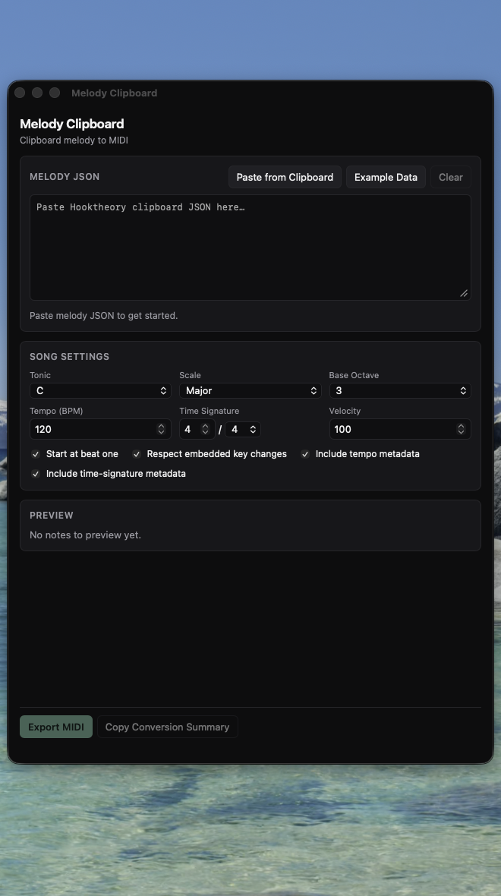
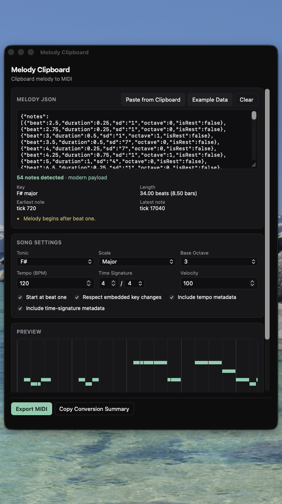

<div align="center">


# Melody Clipboard

Convert Hooktheory-style clipboard melody data into MIDI files for Ableton Live and other DAWs.

[](#downloads)
[](https://github.com/dlln147/melody-clipboard/actions/workflows/ci.yml)
[](https://github.com/dlln147/melody-clipboard/releases/latest)
[](LICENSE)

</div>

## Overview

Melody Clipboard converts supported Hooktheory/Hookpad-style clipboard JSON into
a standard `.mid` file. Copy melody data from a compatible source, paste it into
the app, confirm a few musical settings, and export a MIDI file you can drag
into Ableton Live or any other DAW.

- Everything runs **locally** on your machine.
- It does **not** upload your clipboard contents anywhere — there are no
  network requests in this application at all.
- It does **not** scrape, access, or interact with Hooktheory's website or
  services in any way. You provide the clipboard data; the app only parses
  and converts it.
- It is an independent, unofficial project and is **not affiliated with or
  endorsed by Hooktheory**.
- You are responsible for ensuring you have the right to use and convert
  whatever musical material you paste into the app.

## Features

- Parses both the legacy (`beat`/`duration`) and modern (`startTick`/`durationTicks`)
  Hooktheory clipboard JSON formats, preferring the modern payload when present.
- Automatic tonic and scale detection from embedded key data, with a manual
  override.
- Full scale-degree-to-MIDI conversion: extended degrees (8, 9, 10…),
  accidentals (`b3`, `#4`, `bb7`…), and all seven diatonic modes plus
  harmonic/melodic minor.
- Embedded key-change support — each note resolves against the key in effect
  at its position.
- Lightweight canvas piano-roll melody preview with hover pitch labels.
- Configurable base octave, tempo, time signature, and MIDI velocity.
- Tempo and time-signature metadata written to the exported file (optional).
- Native `.mid` export via the OS save dialog.
- macOS and Windows desktop support.
- Fully offline — no analytics, accounts, or ads.

## Screenshots

<p align="center">
  
  
</p>

## Downloads

Get the latest build from the
**[GitHub Releases page](https://github.com/dlln147/melody-clipboard/releases/latest)**.

| Platform              | File                                                 |
| --------------------- | ---------------------------------------------------- |
| macOS (Apple Silicon) | `Melody Clipboard_<version>_aarch64.dmg`             |
| macOS (Intel)         | `Melody Clipboard_<version>_x64.dmg`                 |
| Windows (x64)         | `Melody Clipboard_<version>_x64-setup.exe` or `.msi` |

Exact filenames are generated by the Tauri bundler and documented precisely
in [`docs/RELEASING.md`](docs/RELEASING.md); the table above shows the
pattern.

**These initial builds are unsigned.** That means macOS and Windows will show
a first-run warning because the app isn't signed by a paid developer
certificate yet — this is a standard OS gatekeeping step, not an indication
that anything is wrong with the file. Only run installers you downloaded
directly from this repository's Releases page.

### macOS: opening an unsigned build

1. Right-click (or Control-click) **Melody Clipboard.app**.
2. Choose **Open**.
3. Click **Open** again in the confirmation dialog.

If macOS still blocks it, go to **System Settings → Privacy & Security**,
scroll to the security notice about Melody Clipboard, and click **Open
Anyway**. You only need to do this once per download.

We do not recommend permanently disabling Gatekeeper or other macOS security
protections — the steps above are sufficient and only apply to this one app.

### Windows: SmartScreen warning

Windows SmartScreen may show "Windows protected your PC" for unsigned
installers. Click **More info**, then **Run anyway** — but only if you
downloaded the installer from
[this repository's Releases page](https://github.com/dlln147/melody-clipboard/releases/latest).
Do not do this for installers from other sources.

## Usage

1. Copy compatible melody data (Hooktheory/Hookpad clipboard JSON) to your
   system clipboard.
2. Open Melody Clipboard.
3. Paste the data into the text area, or click **Paste from Clipboard** /
   use the one-time startup banner if compatible data is already on your
   clipboard.
4. Confirm the detected key, scale, base octave, and tempo (or adjust them).
5. Click **Export MIDI** and choose where to save the `.mid` file.
6. Drag the exported `.mid` file into Ableton Live (or any other DAW) to
   import it.

## Development

### Prerequisites

- [Node.js](https://nodejs.org/) 20+
- [Rust](https://www.rust-lang.org/tools/install) (stable toolchain, via `rustup`)
- Platform build tools:
  - **macOS**: Xcode Command Line Tools (`xcode-select --install`)
  - **Windows**: [Microsoft C++ Build Tools](https://visualstudio.microsoft.com/visual-cpp-build-tools/) and the WebView2 runtime (preinstalled on modern Windows 10/11)

This project uses **npm** (see `package-lock.json`) — don't mix in yarn/pnpm
lockfiles.

### Setup

```bash
npm install
```

### Run in development

```bash
npm run tauri dev
```

### Checks

```bash
npm run lint            # ESLint
npm run typecheck       # tsc --noEmit
npm run format:check    # Prettier
npm run test             # Vitest unit tests
npm run build             # Production frontend build (tsc + vite build)

cd src-tauri
cargo fmt -- --check
cargo clippy --all-targets -- -D warnings
cargo test                # unit tests + tests/integration_export.rs
```

### Production build

```bash
npm run tauri build
```

See [`docs/RELEASING.md`](docs/RELEASING.md) for the full release process,
cross-platform build details, and code-signing notes.

## Supported input

Melody Clipboard accepts Hooktheory-style clipboard JSON in either the
legacy or modern shape. A minimal legacy example:

```json
{
  "notes": [
    { "beat": 1, "duration": 1, "sd": "1", "octave": 0, "isRest": false },
    { "beat": 2, "duration": 1, "sd": "5", "octave": 0, "isRest": false }
  ],
  "keys": [{ "beat": 1, "scale": "major", "tonic": "C" }]
}
```

The full test fixture (`fixtures/f-sharp-major-melody.json`) demonstrates the
modern payload format with exact tick values.

## Privacy

Melody Clipboard:

- Runs entirely locally — no backend server, no telemetry, no analytics.
- Never sends clipboard contents (or anything else) over the network. The
  app makes no network requests at all.
- Reads the system clipboard only when you explicitly ask it to (a button
  click, a keyboard shortcut, or a one-time check right after the window
  opens) — it does not continuously monitor the clipboard.
- Writes to disk only when you export a MIDI file through the native save
  dialog, and only to the location you choose.

## Disclaimer

Hooktheory and Hookpad are trademarks of their respective owner. Melody
Clipboard is an independent, community-built project and is not endorsed by,
affiliated with, or sponsored by Hooktheory.

## Contributing

Contributions are welcome — see [CONTRIBUTING.md](CONTRIBUTING.md).

## Security

To report a security issue, see [SECURITY.md](SECURITY.md).

## License

MIT — see [LICENSE](LICENSE).
